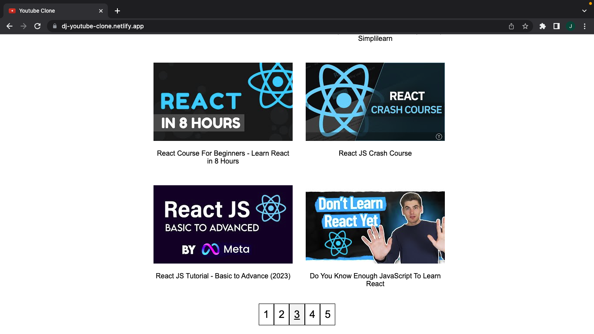

# Youtube Clone Group Project

Pursuit 9.4 Cohort - Module 3 Team Project

Deployed on Netlify: [Youtube Clone](https://diego-jinseok-youtube-clone.netlify.app/)

| Team | 
| ------------- | 
| [Diego Carrero](https://github.com/DiegoCarrero) | 
| [Jinseok Jung](https://github.com/pjungjs) | 

---

### Project Plan

[Project Guide](https://github.com/9-4-pursuit/project-youtube-clone)

[Trello](https://trello.com/b/V7bVv0gd/youtube-project)

[Figma](https://www.figma.com/file/orGbHrmiSQp4fZj4T3Xttd/Untitled?node-id=0%3A1&t=fWA9ysko50f9AqDR-1)

---

### Technologies Used

* HTML/CSS
* JavaScript
* React
* YouTube Data API

---

### How does it work?
<figure>
    <figcaption>The main home page.</figcaption>
    
</figure>
 
<figure>
    <figcaption>The search result.</figcaption>
    
</figure>
 
<figure>
    <figcaption>The pagination on the bottom.</figcaption>
    
</figure>
 
<figure>
    <figcaption>The about page.</figcaption>
    
</figure>
 
<figure>
    <figcaption>The error message.</figcaption>
    
</figure>
 
